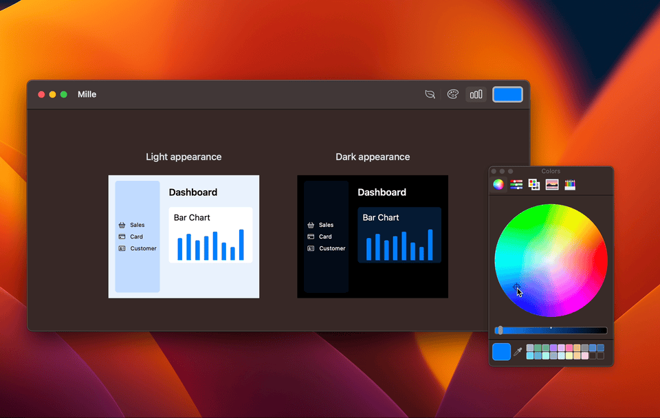

# Mille (Widget Layer Color Tool)

    

**Mille** is the macOS application for simulating the appearance of a hierarchy with widgets using an accent color.

On dashboards, **widgets** are a shortcut for making information blocks recognizable and are one effective means of increasing visibility.

    

    

Mille 0.7.0 supports provisionally **visionOS** 1.0 beta!

    

## Requirements

- macOS 13.0+
- visionOS 1.0+
- Xcode 15.0+
